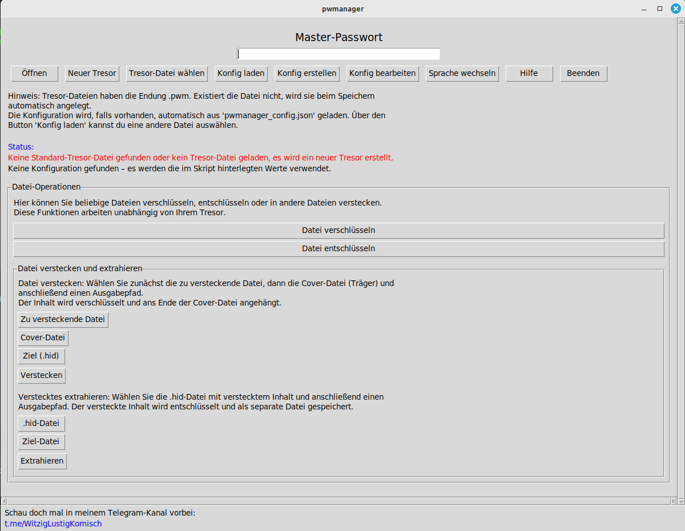
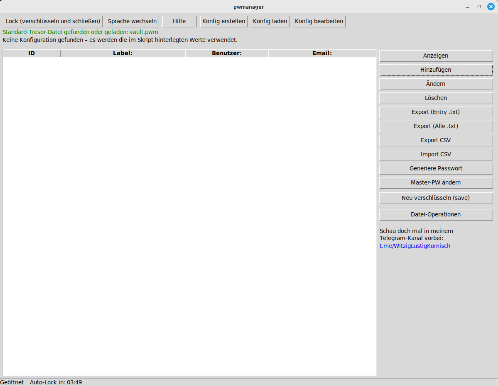
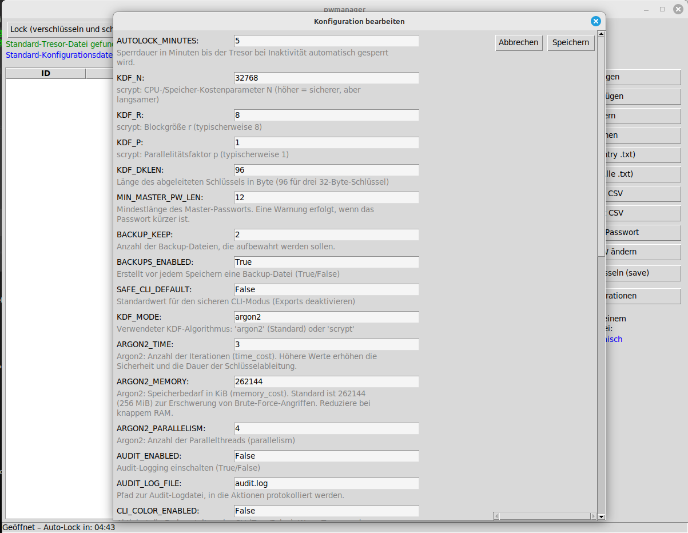

# WLK PasswordSafe – Hochsicherer Passwort‑Manager

<!-- Badges (optional, werden auf GitHub angezeigt) -->
[](LICENSE)
[](#)

*Deutsch weiter unten, English version follows below.*

## Überblick

**WLK PasswordSafe** ist ein plattformübergreifender Passwort‑Manager, der als einzelne Python‑Datei ausgeliefert wird. Er richtet sich an Anwender, die ihre Zugangsdaten sicher, lokal und nachvollziehbar verwalten möchten – ganz ohne Cloud‑Anbindung oder Telemetrie. Dieses Repository enthält:

- **`wlk_passwordsafe.py`** – das aktuelle Hauptskript in Version 2.8.6. Es bietet eine grafische Oberfläche (GUI) und einen mächtigen Kommandozeilenmodus (CLI).
- **`legacy/`** – einen Ordner mit sämtlichen Vorversionen des Programms sowie einer detaillierten Versionshistorie in `legacy/VERSION_HISTORY.md`. So lassen sich Änderungen transparent nachvollziehen.
- **`images/`** – Screenshots der wichtigsten Programmfenster. Die Datei‑Namen sind selbsterklärend (z. B. `gui_no_vault_screen.png`, `cli_main_menu.png`).
- **`README.md`** – diese ausführliche Dokumentation in Deutsch und Englisch.

Das Programm speichert Passwörter in einer verschlüsselten Tresor‑Datei (`.pwm`). Eine dreifache Verschlüsselungskaskade (AES‑GCM → XOR/HMAC‑Pad → ChaCha20‑Poly1305) schützt Ihre Daten. Darüber hinaus können beliebig viele zusätzliche Verschlüsselungsschichten aktiviert werden. Alle Daten werden ausschließlich lokal verarbeitet.

## Inhalt

1. [Funktionen](#funktionen)
2. [Installation](#installation)
3. [Erste Schritte](#erste-schritte)
4. [GUI‑Benutzung](#gui--benutzung)
5. [CLI‑Benutzung](#cli--benutzung)
6. [Konfiguration](#konfiguration)
7. [Steganografie & Datei‑Verschlüsselung](#steganografie--datei--verschlüsselung)
8. [Legacy & Versionsgeschichte](#legacy--versionsgeschichte)
9. [Lizenz & Mitwirkung](#lizenz--mitwirkung)
10. [Credits & Kontakt](#credits--kontakt)
11. [Haftungsausschluss](#haftungsausschluss)
12. [English version](#english-version)

## Funktionen

- **Mehrschichtige Verschlüsselung:** Standardmäßig kombiniert der Tresor AES‑256‑GCM, ein HMAC‑basiertes XOR‑Pad und ChaCha20‑Poly1305. Über die Variable `EXTRA_ENCRYPTION_LAYERS` können Sie zusätzliche XOR/HMAC‑Schichten aktivieren und so Sicherheit gegen Offline‑Angriffe erhöhen.
- **Keyfile & Gerätebindung:** Sie können optional ein externes Schlüssel‑File einbinden, um die Entropie des Master‑Passworts zu erhöhen. Außerdem lässt sich der Tresor an eine Geräte‑ID koppeln (z. B. `/etc/machine-id` unter Linux oder `MachineGuid` unter Windows), sodass sich die Datei nur auf diesem Gerät öffnen lässt.
- **Argon2 Auto‑Tuning:** Falls das Paket `argon2‑cffi` installiert ist, wird Argon2id als Key‑Derivation‑Function (KDF) genutzt. Ein integrierter Benchmark wählt automatisch sichere Zeit‑ und Speicherparameter.
- **Mindestpasswortqualität:** Beim Anlegen eines neuen Tresors prüft das Programm die Mindestlänge, das Vorkommen von Groß‑/Kleinbuchstaben, Ziffern und Sonderzeichen und warnt vor schwachen Passwörtern.
- **Zwischenablage‑Sicherheit:** In der GUI werden Passwörter nach kurzer Zeit automatisch aus der Zwischenablage gelöscht und in Eingabefeldern wieder maskiert.
- **Tabellen & Sortierung:** Info‑Felder können Sie als Tabellen strukturieren und nach Spalten sortieren. Die Eintragsliste lässt sich per Klick auf die Spaltenköpfe sortieren. Rasterlinien (horizontal und vertikal) verbessern die Übersicht.
- **Datei‑ und Steganografie‑Werkzeuge:** Beliebige Dateien lassen sich mit einem Passwort verschlüsseln (`.enc`) oder in Cover‑Bildern verstecken (`.hid`). Ebenso können Sie versteckte Daten wieder extrahieren oder Bilder auf eine Mindestgröße aufblähen.
- **Mehrsprachig:** WLK PasswordSafe erkennt die Systemsprache automatisch und unterstützt Deutsch und Englisch. Über den Parameter `FORCE_LANG` oder per Button lässt sich die Sprache jederzeit ändern.

‑ **Auto‑Lock & Backups:** Der Tresor sperrt sich nach einer definierten Zeit der Inaktivität automatisch (Standard: 5 Minuten, konfigurierbar via `AUTOLOCK_MINUTES`). Beim Speichern werden verschlüsselte Sicherungskopien angelegt; standardmäßig werden zwei Backups aufbewahrt (`BACKUP_KEEP`), damit Sie im Notfall auf eine ältere Version zurückgreifen können.

## Installation

### Voraussetzungen

- Python ≥ 3.9 (empfohlen: aktuelles Python 3.x)
- [cryptography](https://pypi.org/project/cryptography/) (Pflichtmodul für die Verschlüsselung)
- Optional: [argon2‑cffi](https://pypi.org/project/argon2-cffi/) (für Argon2id) und [pyperclip](https://pypi.org/project/pyperclip/) (für Clipboard‑Funktionen)

### Schritt‑für‑Schritt

1. **Repository herunterladen:** Laden Sie dieses Repository herunter oder kopieren Sie lediglich die Datei `wlk_passwordsafe.py` und den Ordner `images/` auf Ihr System.
2. **Virtuelle Umgebung anlegen (empfohlen):**

   Unter Linux/macOS:

   ```bash
   python3 -m venv venv
   source venv/bin/activate
   pip install --upgrade pip
   pip install cryptography argon2-cffi pyperclip
   ```

   Unter Windows (PowerShell):

   ```powershell
   py -m venv venv
   venv\Scripts\Activate.ps1
   pip install --upgrade pip
   pip install cryptography argon2-cffi pyperclip
   ```

3. **Programm starten:** Wechseln Sie in das Verzeichnis, in dem sich `wlk_passwordsafe.py` befindet, und führen Sie das Skript aus:

   ```bash
   python wlk_passwordsafe.py
   ```

   Beim ersten Start wird kein Tresor gefunden. Geben Sie ein neues Master‑Passwort ein und klicken Sie im Login‑Fenster auf **“Neu”**, um einen Tresor anzulegen.

## Erste Schritte

Beim Starten ohne Tresor erscheint das **Anmeldefenster**:



Hier legen Sie ein neues Master‑Passwort fest oder öffnen einen vorhandenen Tresor. Über die Buttons können Sie außerdem eine vorhandene Tresor‑Datei auswählen, eine Konfigurationsdatei laden oder erstellen, zwischen Deutsch und Englisch wechseln, die integrierte Hilfe öffnen oder das Programm beenden.

Sobald der Tresor entsperrt ist, gelangen Sie in die **Hauptansicht**:



Die linke Tabellenansicht listet Ihre Einträge. Die Buttons rechts bieten Zugriff auf alle Funktionen: Anzeigen, Hinzufügen, Bearbeiten, Löschen, Export/Import, starkes Passwort generieren, Master‑Passwort ändern, Tresor neu verschlüsseln und Datei‑Operationen.

Sie können jederzeit die Sprache wechseln, indem Sie im Menü „Sprache wechseln“ auswählen. Der aktuelle Status (gesperrt/entsperrt) sowie ein Telegram‑Hinweis werden im unteren Bereich der GUI angezeigt.

## GUI‑Benutzung

Die grafische Oberfläche ist selbsterklärend und ermöglicht Ihnen die komfortable Verwaltung Ihrer Passwörter. Einige Highlights:

- **Einträge anzeigen und bearbeiten:** Doppelklicken Sie auf einen Listeneintrag oder verwenden Sie die Buttons, um alle gespeicherten Informationen (Benutzername, Passwort, E‑Mail, URL und optionale Notizen) zu sehen oder zu ändern. Passwörter lassen sich mit einem Klick in die Zwischenablage kopieren.
- **Einträge organisieren:** Die Liste kann alphabetisch oder nach URL sortiert werden, indem Sie auf den jeweiligen Spaltenkopf klicken. Info‑Felder können als Tabellen mit Spalten definiert werden. Über die Konfiguration lassen sich Hintergrund‑ und Rasterfarben anpassen.
- **Export & Import:** Einzelne Einträge können als Klartext (`.txt`) exportiert werden; alle Einträge lassen sich als `.txt` oder `.csv` ausgeben. Importieren Sie eine CSV‑Datei, ordnet das Programm jedem neuen Datensatz eine neue eindeutige ID zu. Denken Sie daran, exportierte Klartext‑Dateien sicher zu löschen.
- **Tresor neu verschlüsseln:** Mit dem Button *“Neu verschlüsseln (save)”* speichern Sie den Tresor und generieren neue kryptografische Zufallsdaten (Salts, Nonces und Pads). In der Konfiguration kann die Anzahl der Backups festgelegt werden, die beim Speichern aufbewahrt werden sollen.
- **Datei‑Operationen:** Über das Untermenü können Sie beliebige Dateien verschlüsseln/entschlüsseln oder verstecken/extrahieren. Auch diese Funktionen nutzen dieselben kryptografischen Routinen wie der Tresor.

## CLI‑Benutzung

Für Benutzer, die lieber im Terminal arbeiten oder automatisierte Abläufe erstellen möchten, gibt es den CLI‑Modus. Starten Sie ihn mit:

```bash
python wlk_passwordsafe.py --cli
```

Sie werden nach Ihrem Master‑Passwort gefragt und erhalten anschließend ein numerisches Menü:

```
1 – Einträge auflisten           7 – Alle Einträge exportieren (TXT)
2 – Eintrag anzeigen             8 – Alle Einträge exportieren (CSV)
3 – Eintrag hinzufügen           9 – Starkes Passwort generieren
4 – Eintrag bearbeiten           P – Passwort in Zwischenablage kopieren
5 – Eintrag löschen              S – Tresor neu verschlüsseln (save)
6 – Einzelnen Eintrag exportieren (TXT)
C – Konfiguration erstellen
10 – Datei verschlüsseln         12 – Datei verstecken
11 – Datei entschlüsseln         13 – Versteckte Datei extrahieren
14 – CSV importieren             0 – Beenden (speichert automatisch)
```

Zusätzliche Optionen:

- `--file PATH` – Legt den Pfad der Tresor‑Datei fest. Ohne diese Option wird der Standardname `vault.pwm` verwendet.
- `--config PATH` – Lädt eine Konfigurationsdatei. Standard ist `wlk_passwordsafe_config.json` im gleichen Verzeichnis wie das Skript.
- `--no-gui` – Erzwingt den CLI‑Modus auch auf Systemen mit grafischer Oberfläche.
- `--safe-cli` – Deaktiviert Export‑Funktionen im CLI, sodass keine unverschlüsselten Dateien erstellt werden können.
- `--make-cover` und `--inflate-image` – Erzeugen oder vergrößern Bilder für die Steganografie (siehe unten).


## Konfiguration

WLK PasswordSafe unterstützt das Laden externer JSON‑Konfigurationsdateien. Beim ersten Start wird keine Konfiguration benötigt. Über die GUI können Sie eine Konfigurationsdatei erstellen oder laden; im CLI‑Menü steht die Option „C – Konfiguration erstellen“ zur Verfügung. Standardmäßig wird nach `wlk_passwordsafe_config.json` im Programmverzeichnis gesucht.

In der Konfiguration können Sie u. a. folgende Parameter anpassen:

- **AUTOLOCK_MINUTES** – Zeit in Minuten bis zur automatischen Sperre bei Inaktivität.
- **KDF‑Parameter** – Feineinstellung des scrypt‑Parameters (N, r, p) oder der Argon2‑Parameter (Time, Memory, Parallelism) wenn Argon2 verwendet wird.
- **BACKUP_KEEP** und **BACKUPS_ENABLED** – Anzahl der aufbewahrten Tresor‑Backups und ob Backups generell angelegt werden sollen.
- **SAFE_CLI_DEFAULT** – Ob der CLI‑Modus per Voreinstellung die Export‑Funktionen deaktiviert.
- **Farben und Theme** – Anpassung der Hintergrund‑ und Rasterfarben, Light/Dark‑Theme sowie der Farben für Tabellen.
- **SHOW_TELEGRAM_AD** – Ob die Werbung für den Telegram‑Kanal in der GUI angezeigt wird.

Konfigurationsdateien sind kommentiert und können mit einem beliebigen Texteditor bearbeitet werden. Kommentare beginnen mit `#` und werden beim Einlesen ignoriert.

### Keyfile & Gerätebindung

Um die Sicherheit des Tresors weiter zu erhöhen, können Sie ein externes Keyfile verwenden und/oder die Datei an ein bestimmtes Gerät binden. Fügen Sie dazu folgende Einstellungen in Ihrer Konfigurationsdatei hinzu:

- **KEYFILE_PATH:** Legen Sie hier den Pfad zu Ihrer Schlüsseldatei fest. Der Inhalt dieses Keyfiles wird mit Ihrem Master‑Passwort in die Schlüsselableitung einbezogen. Achten Sie darauf, das Keyfile sicher aufzubewahren – ohne diese Datei kann der Tresor nicht geöffnet werden.
- **DEVICE_BIND:** Setzen Sie diesen Wert auf `true`, um die Gerätebindung zu aktivieren. Dabei wird die jeweilige Geräte‑ID in die Schlüsselableitung gemischt (`/etc/machine-id` unter Linux, `MachineGuid` unter Windows). **Wichtig:** Eine Gerätebindung greift nur für neu erstellte Tresore. Bestehende Tresore müssen neu verschlüsselt werden, um diese Bindung wirksam zu machen.

### Erweiterte Sicherheitsoptionen (optional)

Für besonders sicherheitsbewusste Nutzer bietet das Skript zusätzliche Hardening‑Optionen. Diese können in der Konfiguration gesetzt werden:

- **SAFE_CLI_DEFAULT:** Deaktiviert die Export‑Funktionen im CLI standardmäßig. Exporte sind dann nur nach expliziter Aktivierung erlaubt.
- **SAFE_BLOCK_EXPORT:** Blockiert sämtliche Export‑Optionen (GUI und CLI). So wird verhindert, dass Klartext‑Passwörter auf der Festplatte landen.
- **SAFE_BLOCK_CSV:** Deaktiviert den CSV‑Import, falls Sie keine Daten aus anderen Quellen übernehmen möchten.
- **SAFE_BLOCK_STEGO:** Deaktiviert die Funktionen zum Verstecken/Extrahieren von Dateien in Bildern.
- **SAFE_BLOCK_CLIPBOARD:** Verhindert das Kopieren von Passwörtern in die Zwischenablage.
- **NO_PLAINTEXT_IN_GUI:** Zeigt Passwörter im GUI nie im Klartext an. Sie können sie nur in die Zwischenablage kopieren. Dies erhöht den Schutz vor Shoulder‑Surfing.

Diese Optionen sind standardmäßig deaktiviert und richten sich an fortgeschrittene Anwender, die maximale Kontrolle über das Sicherheitsverhalten wünschen.



## Steganografie & Datei‑Verschlüsselung

Neben der Verwaltung von Tresoren können Sie WLK PasswordSafe nutzen, um Dateien zu verschlüsseln oder Dateien in Bildern zu verstecken (Steganografie):

- **Datei verschlüsseln/entschlüsseln:** Im GUI‑Untermenü „Datei‑Operationen“ oder via CLI‑Menüpunkte `10`/`11` wählen Sie eine Datei, geben ein Passwort ein und wählen einen Zielpfad. Die verschlüsselte Datei erhält die Endung `.enc`. Zum Entschlüsseln wählen Sie eine `.enc`‑Datei und geben das Passwort an. Für Datei‑Verschlüsselung wird die gleiche starke Kryptografie wie für den Tresor verwendet.
- **Datei verstecken (Steganografie):** Menüpunkte `12`/`13` (CLI) oder die entsprechende Option in der GUI erlauben das Verstecken einer Datei in einem Cover‑Bild. Wählen Sie zunächst die zu versteckende Datei, dann ein Cover‑Bild (BMP/PNG/JPEG) und geben Sie ein Passwort an. Das Ergebnis hat die Endung `.hid`. Zum Extrahieren wählen Sie eine `.hid`‑Datei, geben das Passwort ein und speichern das extrahierte Original.
- **Cover‑Bilder erstellen und vergrößern:** Mit den Befehlen `--make-cover OUT.(bmp|png|jpg) --size-mib 1.0` erzeugen Sie ein zufälliges Bild mit der gewünschten Größe. Mit `--inflate-image SRC.(jpg|jpeg|png|bmp) OUT.(jpg|png|bmp) --size-mib 1.0` vergrößern Sie ein vorhandenes Bild durch Hinzufügen von Rauschen bis zur angegebenen Mindestgröße. Diese Werkzeuge sind praktisch, wenn Sie Dateien in Bildern verstecken möchten und das Cover eine Mindestgröße haben soll.

## Legacy & Versionsgeschichte

Alle historischen Versionen des Skripts finden Sie im Ordner [`legacy`](legacy). Die Datei [`legacy/VERSION_HISTORY.md`](legacy/VERSION_HISTORY.md) enthält eine tabellarische Übersicht mit Versionsnummer, Datum und einer kurzen Beschreibung der Änderungen. Die aktuelle Version ist **2.8.6**. Die Änderung von Version 2.8.5 auf 2.8.6 bestand hauptsächlich in der Umbenennung des Programms (`pwmanager` → `wlk_passwordsafe`), der Umbenennung der Konfigurationsdatei und kleineren Anpassungen im Hilfe‑Text. Funktional sind die Versionen identisch.

## Lizenz & Mitwirkung

Dieses Projekt steht unter der **MIT‑Lizenz**. Sie dürfen den Quellcode frei verwenden, verändern und weitergeben, solange Sie den ursprünglichen Urheberrechts‑ und Lizenzhinweis beibehalten. Den vollständigen Lizenztext finden Sie in der Datei [`LICENSE`](LICENSE) sowie im Header von `wlk_passwordsafe.py`.

Contributions sind willkommen. Öffnen Sie bei Fehlern, Verbesserungsvorschlägen oder neuen Features bitte ein Issue oder einen Pull‑Request. Bitte beachten Sie, dass das Projekt auf Sicherheitsbewusstsein ausgelegt ist und Änderungen sorgfältig geprüft werden.

## Credits & Kontakt

`WLK PasswordSafe` wurde von **FleXcon** entwickelt. Besuchen Sie unseren Telegram‑Kanal [@WitzigLustigKomisch](https://t.me/WitzigLustigKomisch) für Neuigkeiten und Support. Dieses Projekt wurde ursprünglich auf Grundlage des alten `pwmanager.py` entwickelt und stetig erweitert.

## Haftungsausschluss

Dieses Programm wird ohne jegliche Gewährleistung bereitgestellt. Die Nutzung erfolgt auf eigene Gefahr. Der Entwickler haftet nicht für Schäden, Datenverluste oder sonstige Probleme, die durch die Verwendung dieser Software entstehen. Bitte erstellen Sie stets Sicherungskopien Ihrer Daten, bevor Sie Verschlüsselungs‑ oder Steganografie‑Funktionen verwenden, und überprüfen Sie die Wiederherstellbarkeit Ihrer Backups.

## Bekannte Probleme

Aktuell sind keine kritischen Fehler bekannt. Sollten Sie dennoch auf Probleme, Inkompatibilitäten oder unbeabsichtigtes Verhalten stoßen, nutzen Sie bitte den Issue‑Tracker dieses Projekts, um diese zu melden. Transparente Fehlerdokumentation hilft allen Nutzern.

---

## English version

### Overview

**WLK PasswordSafe** is a cross‑platform, high‑security password manager delivered as a single Python file. It is designed for users who want to manage their credentials locally and transparently without any cloud service or telemetry. This repository contains:

- **`wlk_passwordsafe.py`** – the main script (version 2.8.6) providing a graphical user interface (GUI) and a powerful command‑line interface (CLI).
- **`legacy/`** – a folder with all previous versions of the program and a detailed change log (`legacy/VERSION_HISTORY.md`).
- **`images/`** – screenshots of the main program windows, named descriptively (e.g. `gui_no_vault_screen.png`, `cli_main_menu.png`).
- **`README.md`** – this documentation in German and English.

Passwords are stored in an encrypted vault file (`.pwm`). A triple encryption cascade (AES‑GCM → HMAC‑based XOR pad → ChaCha20‑Poly1305) protects your data. You can enable any number of additional encryption layers for enhanced resistance against offline attacks. All processing happens entirely on your local machine.

### Table of contents

1. [Features](#features)
2. [Installation](#installation-1)
3. [Getting started](#getting-started)
4. [GUI usage](#gui-usage)
5. [CLI usage](#cli-usage)
6. [Configuration](#configuration)
7. [Steganography & file encryption](#steganography--file-encryption)
8. [Legacy & version history](#legacy--version-history)
9. [Licence & contributing](#licence--contributing)
10. [Credits & contact](#credits--contact)
11. [Disclaimer](#disclaimer)

### Features

- **Multi‑layer encryption:** By default, the vault combines AES‑256‑GCM, an HMAC‑based XOR pad and ChaCha20‑Poly1305. Use the `EXTRA_ENCRYPTION_LAYERS` variable to add further XOR/HMAC layers.
- **Key file & device binding:** Optionally use an external key file to boost entropy and bind the vault to a unique device ID (`/etc/machine-id` on Linux or `MachineGuid` on Windows).
- **Argon2 auto‑tuning:** If the `argon2‑cffi` package is installed, the program switches to Argon2id as the key derivation function and benchmarks your hardware to choose safe time and memory parameters.
- **Minimum password quality:** When creating a new vault, the program checks the master password length, uppercase/lowercase letters, digits and special characters and warns about weak passwords.
- **Clipboard protection:** In the GUI, plaintext passwords are automatically re‑masked and cleared from the clipboard after a short time.
- **Tables & sorting:** Info fields can be structured as tables and sorted by column. The entry list can also be sorted by clicking the column headers. Horizontal and vertical gridlines improve readability.
- **File & steganography tools:** Encrypt any file with a password (`.enc`) or hide files in cover images (`.hid`). You can also extract hidden data or enlarge images to a minimum size.
- **Bilingual:** WLK PasswordSafe automatically detects the system language and supports German and English. You can override the language via the `FORCE_LANG` parameter or a GUI button.

### Installation

#### Requirements

- Python ≥ 3.9
- [cryptography](https://pypi.org/project/cryptography/)
- Optional: [argon2‑cffi](https://pypi.org/project/argon2-cffi/) and [pyperclip](https://pypi.org/project/pyperclip/)

#### Steps

1. **Download:** Clone this repository or copy `wlk_passwordsafe.py` and the `images/` folder to your system.
2. **Create a virtual environment (recommended):**

   On Linux/macOS:

   ```bash
   python3 -m venv venv
   source venv/bin/activate
   pip install --upgrade pip
   pip install cryptography argon2-cffi pyperclip
   ```

   On Windows (PowerShell):

   ```powershell
   py -m venv venv
   venv\Scripts\Activate.ps1
   pip install --upgrade pip
   pip install cryptography argon2-cffi pyperclip
   ```

3. **Run the program:** Navigate to the directory containing `wlk_passwordsafe.py` and start it:

   ```bash
   python wlk_passwordsafe.py
   ```

   On first start the vault does not exist; enter a new master password and click **“New”** in the login window to create one.

### Getting started

When launched without a vault file, the **login window** appears:


Here you set a new master password or open an existing vault. Buttons allow you to select a different vault file, load or create a configuration file, switch languages, open the built‑in help or exit the program.

After unlocking, you enter the **main view**:


The left pane lists your entries. The buttons on the right provide access to all functions: view, add, edit, delete, export/import, generate strong password, change master password, re‑encrypt (save) and file operations.

You can switch languages at any time via the “Switch language” menu. The status bar shows whether the vault is locked or unlocked and contains a Telegram channel invitation.

### GUI usage

The graphical interface lets you manage your passwords comfortably. Highlights include:

- **View and edit entries:** Double‑click an entry or use the buttons to display all stored information (username, password, e‑mail, URL and optional notes) or modify it. Passwords can be copied to the clipboard with a single click.
- **Organize entries:** Sort the list alphabetically or by URL by clicking the column headers. Info fields can be formatted as tables with configurable columns. Colours and gridlines are adjustable via the configuration.
- **Export & import:** Export a single entry as plaintext (`.txt`) or all entries as `.txt` or `.csv`. When importing a CSV file, each new record receives a new unique ID. Be sure to securely delete exported plaintext files after use.
- **Re‑encrypt vault:** The *“Re‑encrypt (save)”* button saves the vault and regenerates cryptographic randomness (salts, nonces and pads). You can configure how many backup files to keep.
- **File operations:** A submenu lets you encrypt/decrypt arbitrary files or hide/extract files in cover images. These operations use the same strong cryptography as the vault.

### CLI usage

For scripting or headless environments, a rich command‑line interface is available. Start it with:

```bash
python wlk_passwordsafe.py --cli
```

You will be prompted for your master password and then presented with a numeric menu:

```
1 – List entries                7 – Export all entries (TXT)
2 – View entry                  8 – Export all entries (CSV)
3 – Add entry                   9 – Generate strong password
4 – Edit entry                  P – Copy password to clipboard
5 – Delete entry                S – Re‑encrypt vault (save)
6 – Export single entry (TXT)
C – Create configuration
10 – Encrypt a file            12 – Hide a file
11 – Decrypt a file            13 – Extract hidden file
14 – Import CSV                0 – Exit (automatically saves)
```

Additional options:

- `--file PATH` – path to the vault file (defaults to `vault.pwm` if omitted).
- `--config PATH` – load a specific configuration file. The default is `wlk_passwordsafe_config.json` in the script directory.
- `--no-gui` – force CLI mode even on systems with a GUI.
- `--safe-cli` – disable export functions in CLI so no plaintext files can be written.
- `--make-cover` and `--inflate-image` – create or enlarge images for steganography (see below).


### Configuration

WLK PasswordSafe supports external JSON configuration files. You don’t need one for the first start; the GUI and CLI allow you to create or load a configuration. By default the program looks for `wlk_passwordsafe_config.json` in the program directory.

You can adjust parameters such as:

- **AUTOLOCK_MINUTES** – time in minutes before the vault locks itself when idle.
- **KDF parameters** – fine tuning of scrypt (N, r, p) or Argon2 parameters (Time, Memory, Parallelism) if Argon2 is used.
- **BACKUP_KEEP** and **BACKUPS_ENABLED** – how many vault backups to keep and whether backups are created at all.
- **SAFE_CLI_DEFAULT** – whether CLI export functions are disabled by default.
- **Colours and theme** – adjust background colours, gridline colours and toggle between light/dark mode.
- **SHOW_TELEGRAM_AD** – whether the Telegram channel advertisement appears in the GUI.

Configuration files are self‑documenting; lines beginning with `#` are comments and ignored by the parser. You can edit the file with any text editor or through the built‑in editor in the GUI/CLI.

#### Key file & device binding

To further increase security you can use an external key file and/or bind the vault to a specific device. Add the following settings to your configuration:

- **KEYFILE_PATH:** Specify the path to your key file. The contents of this file are mixed with your master password during key derivation. Keep the key file safe – without it you cannot open the vault.
- **DEVICE_BIND:** Set this to `true` to enable device binding. The unique device ID (`/etc/machine-id` on Linux or `MachineGuid` on Windows) is mixed into the key derivation. **Note:** Device binding only applies to newly created vaults; existing vaults must be re‑encrypted for the binding to take effect.

#### Advanced security options (optional)

For users requiring maximum hardening the script includes additional options that can be set in the configuration:

- **SAFE_CLI_DEFAULT:** Disables export functions in the CLI by default. Exports can only be enabled explicitly.
- **SAFE_BLOCK_EXPORT:** Blocks all export functions (both GUI and CLI) so that no plaintext passwords are ever written to disk.
- **SAFE_BLOCK_CSV:** Disables CSV import if you do not intend to import data from other sources.
- **SAFE_BLOCK_STEGO:** Disables the steganography functions (hide/extract files in images).
- **SAFE_BLOCK_CLIPBOARD:** Prevents copying passwords to the clipboard.
- **NO_PLAINTEXT_IN_GUI:** Prevents displaying passwords in clear text in the GUI; you can only copy them to the clipboard. This mitigates shoulder‑surfing.

These options are disabled by default and are aimed at advanced users who want fine‑grained control over the program’s behaviour.


### Steganography & file encryption

Beyond password management, WLK PasswordSafe includes tools for securing arbitrary files:

- **Encrypt/decrypt file:** In the GUI’s “File operations” submenu or via CLI menu items `10`/`11`, select an input file, supply a password and choose an output path. The encrypted file receives the `.enc` extension. To decrypt, select a `.enc` file and provide the password. These operations use the same robust cryptography as the vault.
- **Hide/extract file (steganography):** Menu items `12`/`13` (CLI) or the corresponding GUI option allow hiding a file within a cover image. Choose the file to hide, then a cover image (BMP/PNG/JPEG) and a password. The output has the `.hid` extension. To extract, choose a `.hid` file, enter the password and save the extracted original.
- **Create and inflate cover images:** Use `--make-cover OUT.(bmp|png|jpg) --size-mib 1.0` to generate a random image of a given size or `--inflate-image SRC.(jpg|jpeg|png|bmp) OUT.(jpg|png|bmp) --size-mib 1.0` to enlarge an existing image with noise until it reaches the specified minimum size. These tools are helpful when hiding files in images and you need a sufficiently large cover.

### Legacy & version history

All historic versions of the script are stored in the [`legacy`](legacy) directory. [`legacy/VERSION_HISTORY.md`](legacy/VERSION_HISTORY.md) provides a table of versions, release dates and concise change descriptions. The current version is **2.8.6**, whose main purpose was to rename the program (`pwmanager` → `wlk_passwordsafe`), rename the default configuration file and update help texts. No functional changes were made compared to 2.8.5.

### Licence & contributing

This project is released under the **MIT License**. You may use, modify and distribute the code freely as long as you retain the original copyright notice and licence terms. The full licence text is available in the [`LICENSE`](LICENSE) file as well as at the top of `wlk_passwordsafe.py`.

Contributions are welcome. If you encounter bugs, have ideas for improvements or wish to add features, please open an issue or submit a pull request. Note that this project places a strong emphasis on security; all changes will be reviewed carefully.

### Credits & contact

`WLK PasswordSafe` is developed by **FleXcon**. For news and support, visit our Telegram channel [@WitzigLustigKomisch](https://t.me/WitzigLustigKomisch). The program is based on earlier versions of `pwmanager.py` and has been continuously improved.

### Disclaimer

This program is provided **as is** without any warranty. Use it at your own risk. The developer is not liable for damages, data loss or other issues arising from the use of this software. Always keep backup copies of your data before using encryption or steganography features and verify that your backups are recoverable.

### Known issues

There are currently no known critical issues. If you encounter problems, incompatibilities or unintended behaviour, please use the issue tracker to report them. Clear documentation of issues helps all users.